# Highly Available & Secure Static Website Hosting on AWS

A production-style AWS infrastructure project that hosts a static HTML website behind a secure, scalable, and highly available architecture built the way a real company would deploy a customer facing site, not just a "click-through" tutorial.This project intentionally uses EC2 + ALB + Auto Scaling rather than S3 + CloudFront, even though S3 would be more cost-effective for purely static content. The goal was to demonstrate VPC design, subnet architecture, security group configuration, and load balancing  skills that transfer directly to hosting dynamic applications, not just static files. In a real cost-sensitive production scenario with no dynamic content, I would recommend S3 + CloudFront instead, and have outlined that trade-off here to show I understand when each approach is appropriate.

  

---

## Table of Contents
- [The Problem](#the-problem)
- [The Solution](#the-solution)
- [Architecture Diagram](#architecture-diagram)
- [AWS Services Used & Why](#aws-services-used--why)
- [Network Design](#network-design)
- [Implementation Walkthrough](#implementation-walkthrough)
- [Domain & SSL Setup](#domain--ssl-setup)
- [Security Considerations](#security-considerations)
- [Challenges & Troubleshooting](#challenges--troubleshooting)
- [What I'd Improve / Next Steps](#what-id-improve--next-steps)
- [Skills Demonstrated](#skills-demonstrated)
- [About Me](#about-me)

---

## The Problem

Imagine a small business wants to launch its marketing website. They need it to:

- **Stay online** even if a server or an entire data center (Availability Zone) goes down
- **Scale automatically** during traffic spikes (e.g., a product launch or ad campaign) without manual intervention
- **Be secure**, with no direct public access to backend servers
- **Use a custom, professional domain** (not an AWS-generated URL) served over HTTPS
- **Keep costs reasonable** no need for a database or complex backend since the content is static


## The Solution

I designed and deployed a **multi-AZ, auto-scaling, load-balanced web hosting architecture** on AWS, fully isolated inside a custom VPC, with encrypted traffic via a custom domain and a free SSL certificate. Backend instances are never exposed directly to the internet all access is controlled through a bastion host and security groups following least-privilege principles.

Because the website is static (HTML/CSS/JS only, no dynamic content or user data), I deliberately **excluded RDS** from the architecture adding a database here would have been unnecessary cost and complexity for the problem being solved. This was a scoping decision, not an oversight.

---

## Architecture Diagram

> _Add your architecture diagram image here, e.g.:_
> ``

**High-level traffic flow:**

```
Internet
   │
   ▼
Route 53 (DNS: myawspoject.fyi)
   │
   ▼
ACM (SSL/TLS Certificate)
   │
   ▼
Application Load Balancer (Public Subnets, Multi-AZ)
   │
   ▼
Auto Scaling Group → EC2 Instances (Private Subnets, Multi-AZ)
   │
   ▼
NAT Gateway (outbound internet for updates/patches only)

Bastion Host (Public Subnet) → SSH → EC2 Instances (Private Subnets)
```

---

## AWS Services Used & Why

| Service | Purpose | Why I Chose It |
|---|---|---|
| **VPC (Public + Private Subnets)** | Network isolation | Separates internet-facing resources (ALB, bastion host) from backend servers (EC2), reducing attack surface |
| **EC2** | Hosts the static website | Simple, cost-effective compute for serving static content |
| **Auto Scaling Group** | Automatically adds/removes EC2 instances | Ensures the site handles traffic spikes and self-heals if an instance fails, without manual intervention |
| **Application Load Balancer (ALB)** | Distributes traffic across EC2 instances | Removes single point of failure, enables health checks, and terminates SSL at the edge |
| **NAT Gateway** | Outbound internet access for private subnet instances | Lets EC2 instances pull OS updates/packages without being reachable from the internet |
| **Security Groups** | Instance-level firewall rules | Enforces least-privilege access e.g., EC2 only accepts traffic from the ALB, not the public internet |
| **Bastion Host** | Secure SSH entry point | Provides controlled, auditable access to private EC2 instances without exposing them directly |
| **Route 53** | DNS management | Routes the custom domain to the ALB and enables health-check-based routing |
| **AWS Certificate Manager (ACM)** | Free SSL/TLS certificate | Encrypts traffic in transit (HTTPS) and builds trust with visitors required for any real-world site |
| **Porkbun (domain registrar)** | Domain purchase | Registered the domain externally and pointed the nameservers to Route 53, showing I can integrate AWS with third-party services a common real-world scenario |

**Deliberately not used:** RDS since the website is static with no dynamic data, introducing a database would have added unnecessary cost and operational overhead without solving a real problem.

---

## Network Design

- **Public Subnets (Multi-AZ):** Application Load Balancer, NAT Gateway, Bastion Host
- **Private Subnets (Multi-AZ):** EC2 instances running the website (not directly reachable from the internet)
- **Security Groups:**
  - ALB Security Group → allows inbound HTTP/HTTPS (80/443) from `0.0.0.0/0`
  - EC2 Security Group → allows inbound HTTP only from the ALB security group
  - Bastion Security Group → allows inbound SSH (22) only from my IP address
  - EC2 SSH access → allowed only from the bastion host security group, not the public internet

This design means there is **no direct path from the internet to the EC2 instances** all traffic must pass through the ALB (for web traffic) or the bastion host (for SSH/admin access).

---

## Implementation Walkthrough

_Screenshots below document each stage of the build for verification and transparency._

### 1. VPC & Subnet Setup
Created a custom VPC with public and private subnets across two Availability Zones for high availability.


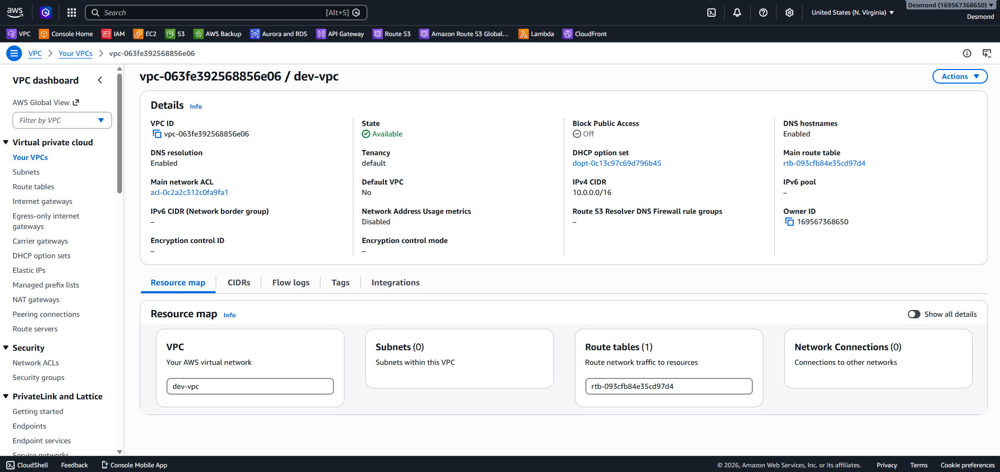
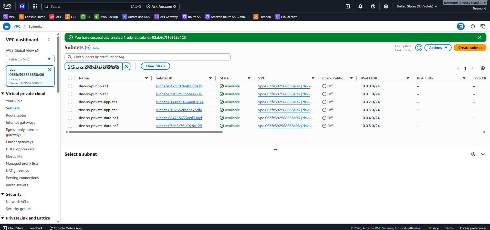

### Resource Map Visuals
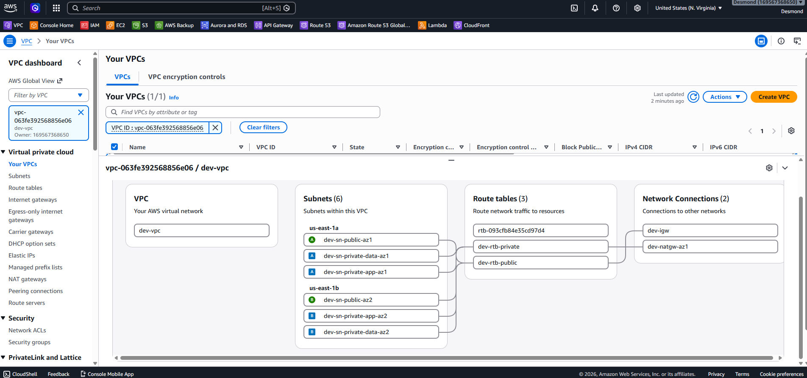`

### 2. Internet Gateway
Attached Internet Gateway to the VPC so that resources in the VPc can access the internet 

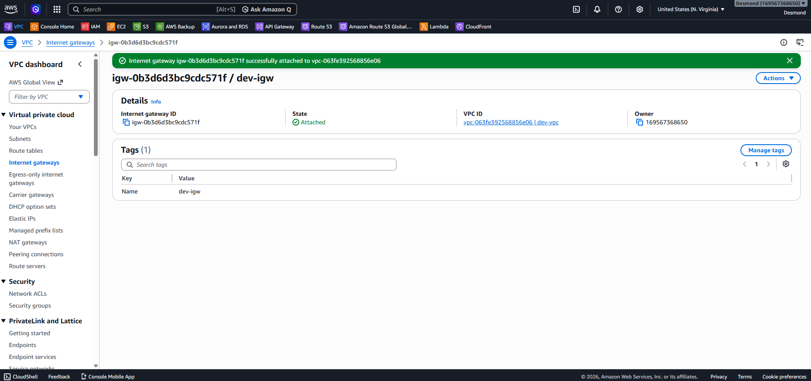

### 3. NAT Gateway
Deployed a NAT Gateway in the public subnet to allow private EC2 instances outbound only internet access.

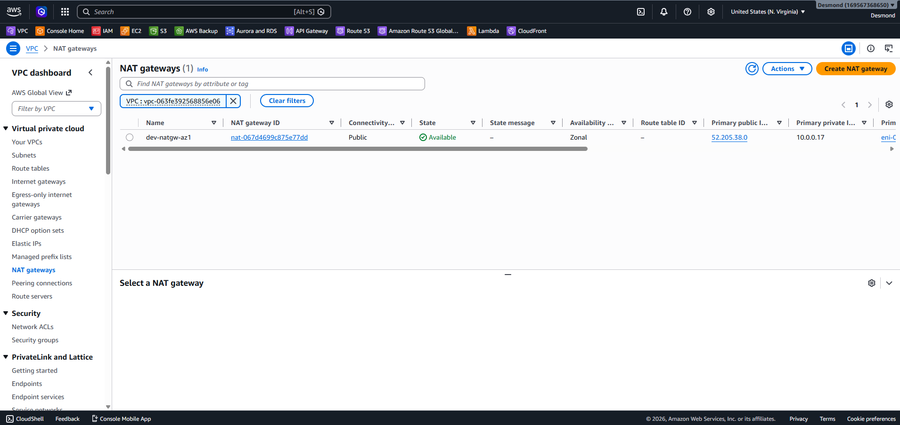

### 4. Security Groups
Configured least-privilege security groups for the ALB, EC2 instances, and bastion host.

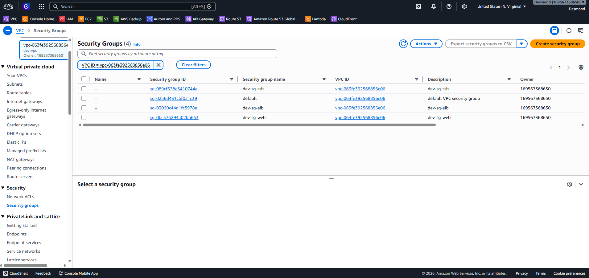

### 5. Bastion Host & SSH Access
Launched a bastion host in the public subnet and used it to securely SSH into private EC2 instances.

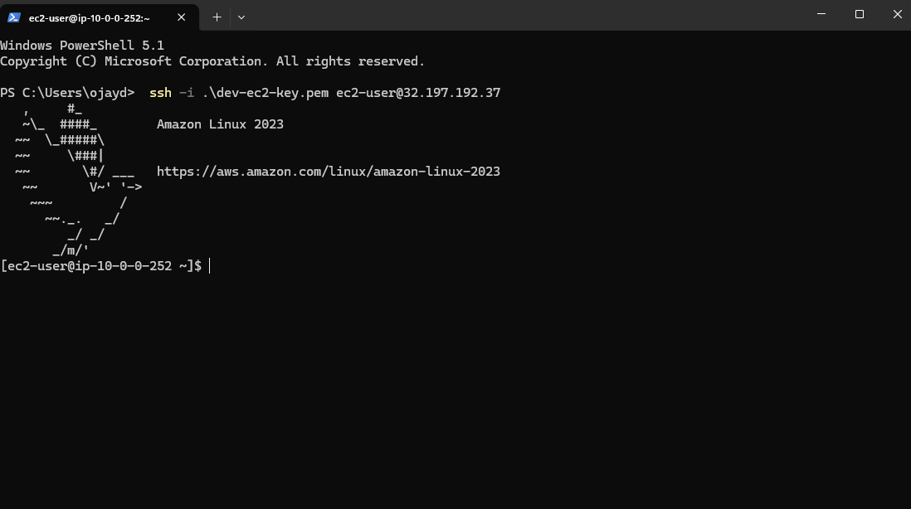
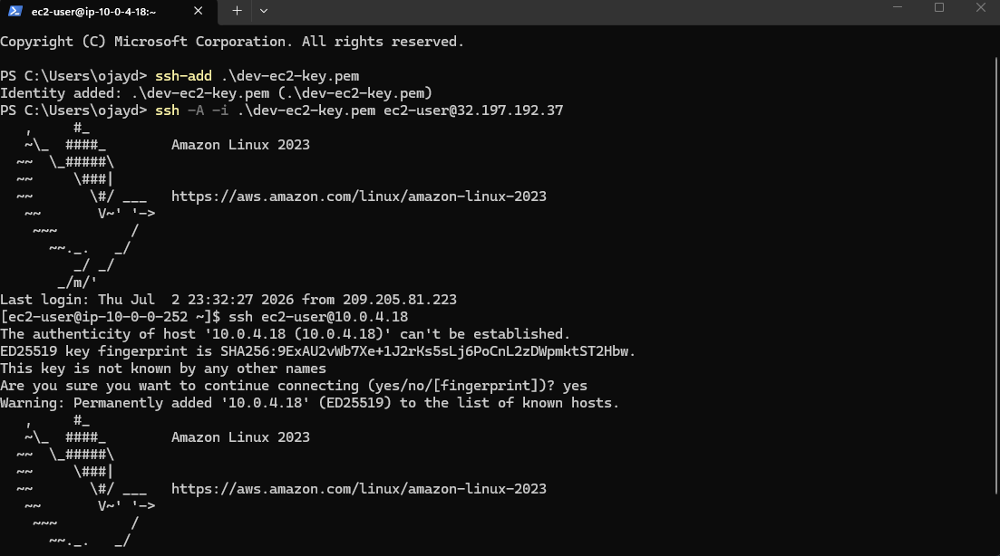

### 6. Auto Scaling Group
Created a launch template and Auto Scaling Group to automatically maintain healthy instance counts across AZs.

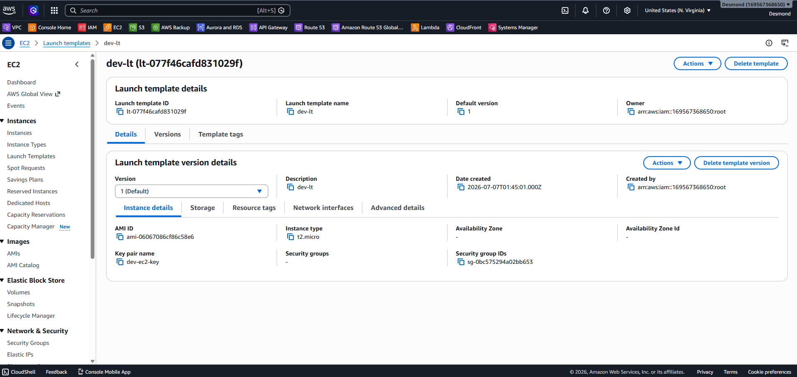
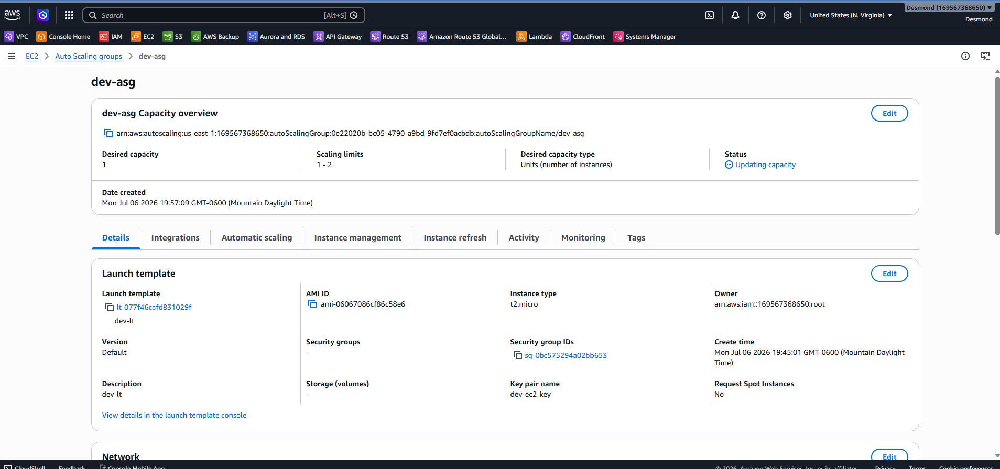


### 7. Application Load Balancer
Deployed an ALB across public subnets with health checks targeting the private EC2 instances (devwebserver).

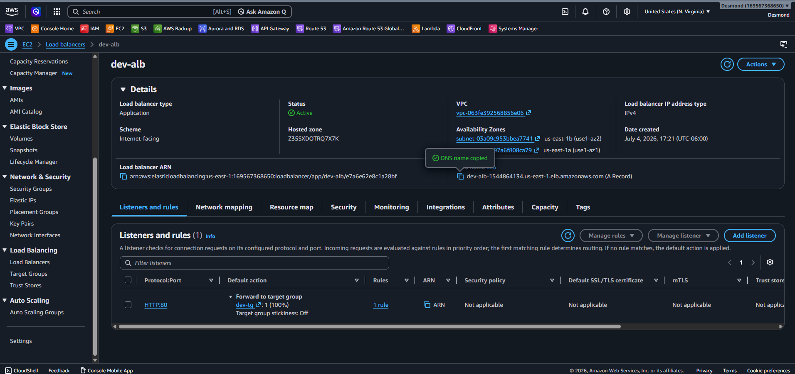
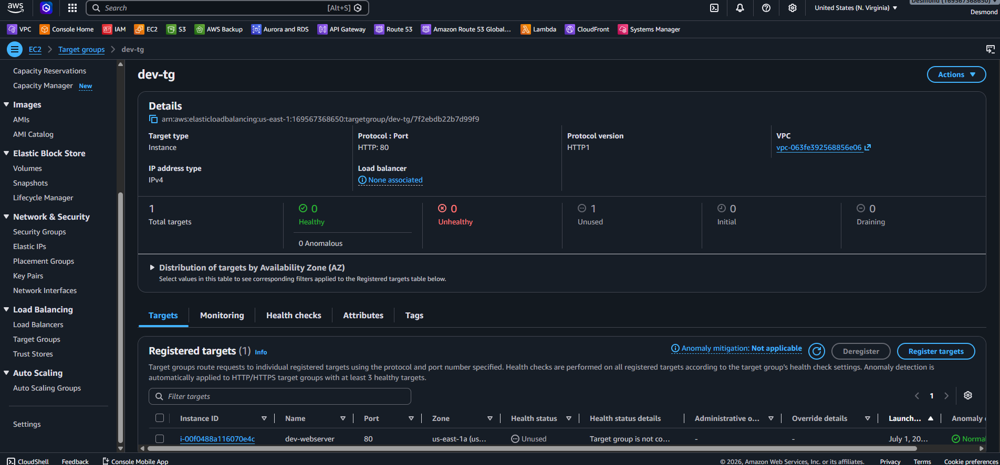


### 8. Domain, SSL & Route 53
Requested an SSL certificate via ACM, created an both HTTPS and HTTP listener on the ALB, and connected the Porkbundomain via Route 53.

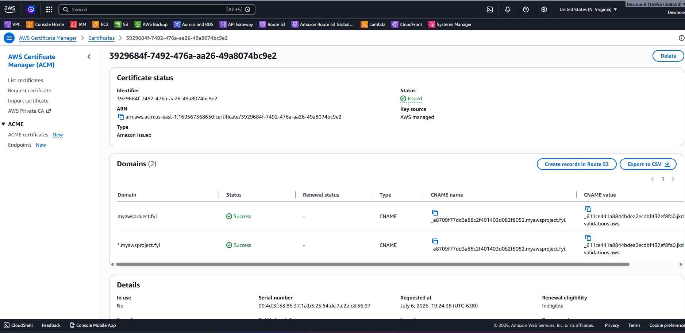
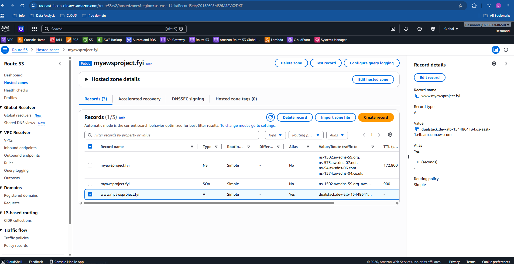
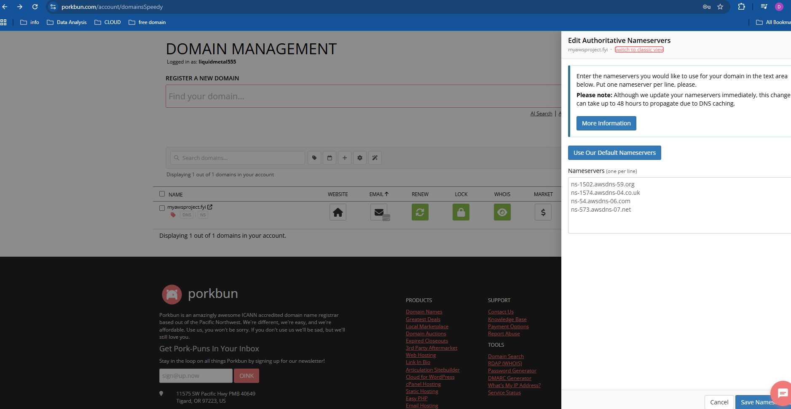

### 9. Live Website
Final result  the site loading securely over HTTPS on the custom domain
Screenshot of the front page: This is a screenshot of the application’s front page. The web application files have been provided in this repository, but the live version is not currently available because the AWS resources were deleted to avoid additional charges.


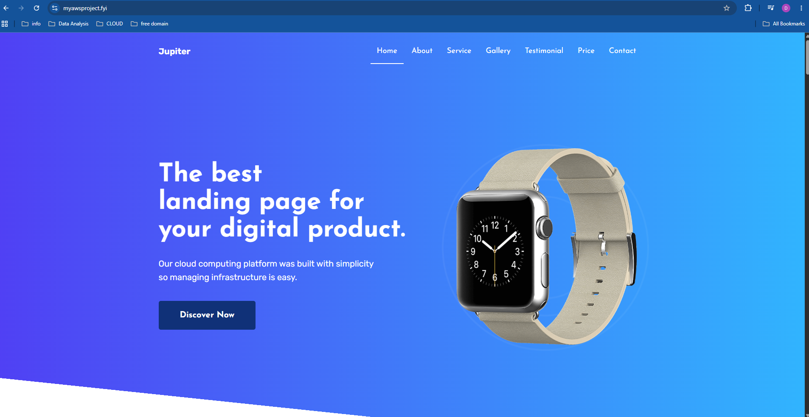

---

## Domain & SSL Setup

- Purchased the domain through **Porkbun** (an external registrar) rather than Route 53 directly a common cost-saving decision companies make
- Updated Porkbun's **nameservers** to point to the AWS Route 53 hosted zone, connecting third-party DNS management to AWS
- Created a Route 53 **record set** to route the domain to the Application Load Balancer
- Requested a free public SSL certificate through **AWS Certificate Manager**, validated via DNS
- Configured an **HTTPS listener** on the ALB so all traffic is served securely over port 443

---

## Security Considerations

- No EC2 instance has a public IP address  all are in private subnets
- All SSH access flows through a single, auditable **bastion host**
- Security groups follow **least-privilege**: each resource only accepts traffic from the specific resource it needs to (ALB → EC2, bastion → EC2, internet → ALB only)
- HTTPS enforced end-to-end at the load balancer using ACM
- Outbound-only internet access for private instances via NAT Gateway (for patching/updates)

---

## Challenges & Troubleshooting


- **ALB health checks failing initially** traced to the EC2 security group not allowing inbound traffic from the ALB's security group (only had my IP allowed). Fixed by updating the EC2 SG to accept traffic from the ALB SG specifically.
- **SSH access from bastion to private instance timing out** resolved by correcting the private instance's security group to allow SSH only from the bastion host's security group, and confirming the correct `.pem` key was used with agent forwarding.
- **DNS not resolving after Porkbun nameserver update**  propagation delay; confirmed using `dig` and AWS Route 53 health checks before traffic routed correctly.

---

## What I'd Improve / Next Steps

Being upfront about the current limitations  and how I'd evolve this if it were a real production system:

- **Infrastructure as Code:** Rebuild this using **Terraform** or **CloudFormation** instead of manual console setup, for repeatability and version control
- **CI/CD Pipeline:** Automate deployments with **CodePipeline/CodeBuild** or GitHub Actions so website updates deploy automatically on push
- **CloudFront CDN:** Add a CloudFront distribution in front of the ALB to reduce latency globally and offload traffic from EC2
- **WAF:** Attach AWS WAF to the ALB to protect against common web exploits
- **Monitoring & Alerting:** Add CloudWatch dashboards and alarms (e.g., unhealthy target alerts, high CPU triggers) with SNS notifications
- **Cost Optimization:** Evaluate replacing EC2 + ASG with **S3 static website hosting + CloudFront** for this specific static-content use case, which would be cheaper and simpler while keeping this EC2-based version to demonstrate VPC/networking/ALB skills
- **Logging:** Enable ALB access logs and VPC Flow Logs for auditability

---

## Skills Demonstrated

`AWS VPC` `Subnetting` `EC2` `Auto Scaling` `Application Load Balancer` `NAT Gateway` `Security Groups` `Bastion Host / SSH` `Route 53` `DNS Management` `AWS Certificate Manager` `HTTPS/SSL` `Third-Party Domain Integration` `Cloud Networking Fundamentals` `Troubleshooting`

---


**[Desmond Ojei]**
  [LinkedIn](https://www.linkedin.com/in/desmond-ojei/) 

 
---
 
*This project was built as a hands-on exercise in designing AWS infrastructure the way a real business would need it, prioritizing availability, security, and scalability over a minimal "it works" setup.*
